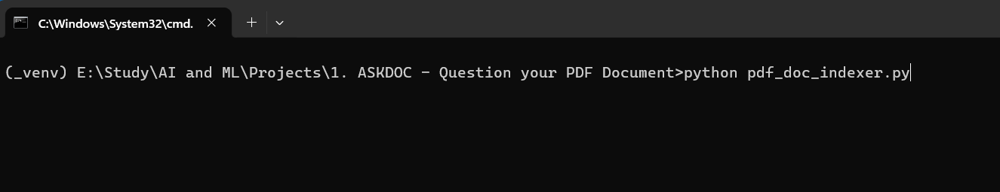

# ASKDOC - chat with your PDF documents!

## Overview

The Intelligent Chatbot project - **ASKDOC*** combines the power of *Langchain*, *Azure OpenAI* models, and Python to deliver an intelligent question-answering system, that completely works with Human Natural Language. This project comprises two main components: `pdf_doc_indexer.py` for indexing PDF document textual data and `chatbot.py` for interactive chat-based querying using Natural Language, based on the PDF document data.

## Project Components

### 1. PDF Document Indexing (`pdf_doc_indexer.py`)

This is the primary step, needed to be performed on the PDF document(s), before they can be queried using Natural Language.
The `pdf_doc_indexer.py` script is responsible for indexing PDF documents, converting their contents into embeddings using the Azure OpenAI model 'text-embedding-ada-002', and storing the embeddings in a Faiss vector database. The process involves the following steps:

#### Usage:

```
python pdf_doc_indexer.py
```

Follow the on-screen prompts to enter the PDF file name for indexing. The script uses Langchain's PyPDFLoader to load the contents of the PDF documents, split the document data into chunks and Langchain's AzureOpenAIEmbeddings to generate embeddings for each chunk. The Faiss index is saved in the faiss_vector_dbs folder.

**Note:**

Make sure to place your PDF documents in the `pdf_docs/` folder, before starting their indexing process.

After successfull indexing, the files are ready to be questioned!!!


### 2. Chatbot (chatbot.py)

The chatbot.py script allows users to interactively query indexed PDF documents using Langchain's Azure Chat OpenAI model. The chatbot incorporates conversational context to provide more accurate answers. Key features include:

Usage:
```
python chatbot.py
```

Follow the on-screen prompts to enter the PDF file name to be queried. Engage in a conversation with the chatbot, and it will intelligently respond based on the indexed document.
Note:

- Enter 'q', 'quit', 'exit', or 'close' to end the conversation.

The chatbot leverages FAISS for document retrieval, and similarity search, and Azure OpenAI models for language understanding.

## Setup and Dependencies
Create a Python virtual environment (preffered), and inside it, install the required package, using the following command:

    pip install -r requirements.txt

### Environment Variables:

Create a `.env` file in the project's root directory, and set the following variables:


        AZURE_OPENAI_KEY=<your_azure_openai_key>
        AZURE_OPENAI_ENDPOINT=<your_azure_openai_endpoint>
        AZURE_GPTTURBO_DEPLOYMENT_NAME=<your_gptturbo_deployment_name>
        AZURE_OPENAI_ADA_EMBEDDING_DEPLOYMENT_NAME=<your_embedding_deployment_name>
        API_VERSION=2023-05-15

## Project Structure

    "pdf_docs/": Folder to store PDF documents for indexing.
    "faiss_vector_dbs/": Folder to store Faiss vector databases. Inside it, folders are created based on names of document, and they are automatically handled.
    "chatbot.py": Interactive chatbot script.
    "pdf_doc_indexer.py": PDF document indexing script.

## Step-by-Step Usage Screenshots, using a sample file:

1. Clone the repository onto your system. Then, create the virtual environment, install the packages using `requirements.txt`, and make the `.env` file as stated. After that, the project directory will have the following structure:

	


2. Here, the rest of the steps will be showcased using a file named `my_into.pdf`, in which there lies my details, such as what are my skills, qualification, expertise, etc. The file is placed inside the `pdf_docs` folder, as follow:

	
<br>
<b>To avoid getting errors during indexing:-</b> <br>
	a. <b>Rename the pdf document to a shorter name(name being about 1 to 40 characters long, e.g.- "rich_dad_poor_dad.pdf"), if the original pdf name is long.</b> <br>
	b. <b>Rename to remove any special characters, if any, from the name of the document. E.g.- #, @, |, \, /, *, &, %, $, =**</b> <br>

3. The contents of the file are shown as below... The contents are very much specific to me, so if question asked from it is answered correctly, then the application potencial can be understood by the ones who are planning to give it a go:
	
	

4. After pdf document is placed in the folder, launch cmd (or ide of your choice). The steps told here are using cmd, such that it requires least setup. Inside cmd, activate the virtual environment as follow:

	

5. After activating virtual environment, run the `pdf_doc_indexer.py` program:

	

6. In the program input asked next, entered your file name, exactly in the format as described in the prompt:

	

7. After the program runs successfully (if no error comes due to file not present, etc.), inside the `faiss_vector_dbs` folder, we can see a folder being created, in the format of `{file_name}_faiss_index` :

	

8. Inside the folder, two files are being created, namely `index.faiss` and `index.pkl` :

	

9. After successfully indexing the data of pdf document, run the `chatbot.py` file, while the virtual environment is active, as follow:

	

10. After that, `User: ` prompt is displayed (if there are no errors, in API config or else). Type your query, and get it answered. Ignore deprecation warnings (if any)...

	

---------------------------------------------------------------------------------------------------------------------------------------------------------------------

## Author

**Debanjan Sarkar**<br>
<a href="https://www.linkedin.com/in/debanjan-sarkar-2001/" target="_blank">LinkedIn</a><br>
<a href="https://github.com/DebanjanSarkar" target="_blank">Github</a><br>
<a href="https://twitter.com/darkolexis" target="_blank">Twitter (X)</a><br><br>
Feel free to explore, contribute, and enhance the ASKDOC project! If you have any questions or suggestions, please don't hesitate to contact the author. 
